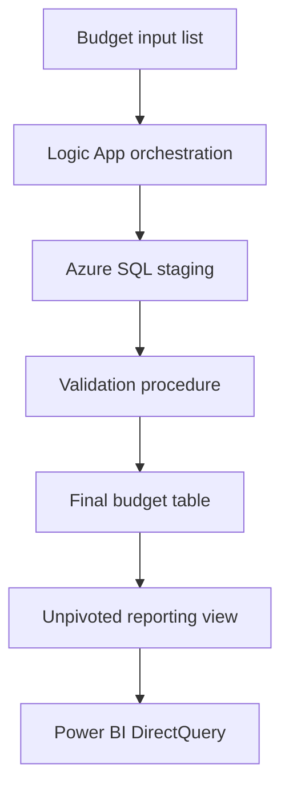

# Budget Data Integration & Automation

Synthetic reference implementation of a SharePoint-to-Azure SQL budget pipeline using Logic Apps, staging/final layers, stored procedures, SQL unpivoting, DirectQuery-ready outputs, and business-rule validation.

No employer lists, credentials, URLs, or budget data are included.

## Architecture

## Control Design

- Load-run audit record and row counts
- Staging validation before final-table replacement
- Duplicate business-key detection
- Typed monthly amount columns
- Transactional final refresh
- Reporting view that unpivots months into a period/amount structure
- No credentials stored in workflow definitions

## Resume Alignment

**Technologies:** SharePoint, Azure Logic Apps, Azure SQL, Power BI

Demonstrates an automated list-to-SQL flow with stored procedures, staging/final layers, DirectQuery, SQL unpivoting, and explicit business rules.
