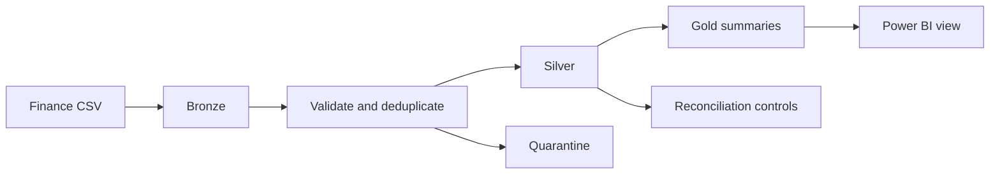

# Finance Reporting Modernization

**Status: Working example**

I built this project around a finance-reporting problem I have handled in practice: transformations were repeated inside reporting files, which made control checks and later changes harder. The public version shows how I move that work into a reusable Spark pipeline before Power BI consumes the data.

Everything here uses synthetic data and generic business names. It contains no employer data, internal source code, credentials or report designs.

## What the pipeline does

1. Reads a finance CSV extract into a Bronze dataset.
2. Standardizes dates, amounts, entity, account, cost centre, scenario and currency.
3. Keeps the latest version of each source record.
4. Sends invalid records to quarantine with an explainable rejection reason.
5. Creates Gold P&L and cost-centre summaries.
6. Writes reconciliation totals by scenario and currency.
7. Exposes a SQL view shaped for Actual, Budget and Forecast reporting in Power BI.



## Try it locally

Requirements: Python 3.11 and Java 17.

```bash
python -m venv .venv
source .venv/bin/activate
pip install -r ../../requirements.txt

spark-submit src/run_pipeline.py \
  --input data/finance_transactions.csv \
  --output build/finance \
  --format parquet
```

The sample contains a later correction for one record and three deliberately invalid rows. After the run, review:

```text
build/finance/bronze/       source-aligned records
build/finance/silver/       validated latest records
build/finance/quarantine/   rejected records and reasons
build/finance/gold/         P&L and cost-centre summaries
build/finance/controls/     row counts and control totals
```

Run the automated tests from the repository root:

```bash
pytest -q
```

## Project files

| Path | Purpose |
|---|---|
| [src/finance_medallion.py](src/finance_medallion.py) | Reusable transformations and quality rules |
| [src/run_pipeline.py](src/run_pipeline.py) | Runnable Spark command-line job |
| [data/finance_transactions.csv](data/finance_transactions.csv) | Synthetic input including corrections and rejected rows |
| [docs/data-contract.md](docs/data-contract.md) | Source contract and validation rules |
| [databricks.yml](databricks.yml) | Databricks job configuration example |
| [sql/power-bi-view.sql](sql/power-bi-view.sql) | Reporting view for Actual/Budget/Forecast |
| [repository tests](../../tests/test_portfolio_projects.py) | Deduplication, reconciliation and schema tests |

## Design choices I can explain in an interview

- **Latest-record deduplication:** finance corrections can arrive after the first load, so `updated_at` determines the retained version.
- **Quarantine instead of silent deletion:** invalid rows remain visible with a reason and can be corrected or investigated.
- **Separate control output:** finance users need row counts and control totals, not only a technically successful job.
- **Curated Gold tables:** Power BI receives the columns and grain needed for reporting rather than every raw source field.
- **Idempotent output:** rerunning the same sample replaces the project output and returns the same result.

The local example writes Parquet so it runs without an Azure account. The included Databricks configuration switches the same job to Delta format and uses deployment-supplied storage paths.
