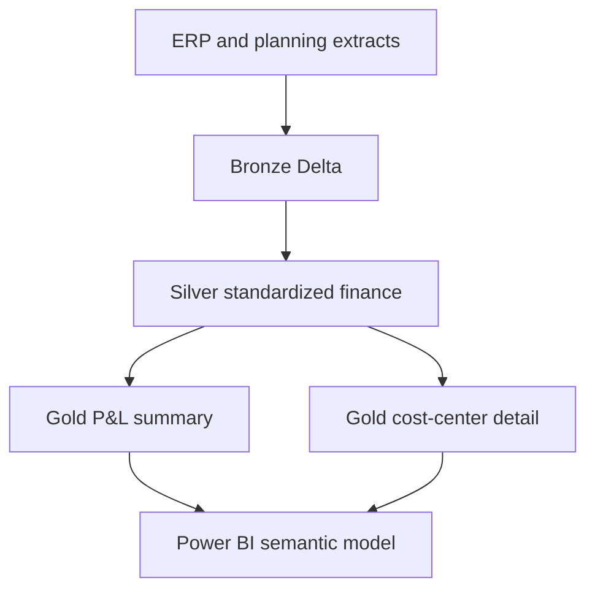

# Finance Reporting Modernization

Portfolio-safe synthetic recreation of a finance-reporting modernization pattern using Azure Databricks, PySpark, Delta Lake, SQL, and Power BI. It contains no employer source code, credentials, or financial data.

## Problem

Finance reporting commonly depends on repeated extracts, inconsistent transformations, and report-specific datasets. The objective is to create governed, reusable Bronze/Silver/Gold layers that support multiple Power BI products with consistent business logic.

## Architecture

## Capabilities

- Explicit source validation and ingestion metadata
- Standard account, entity, cost-center, currency, and scenario fields
- Duplicate handling and incremental Delta `MERGE`
- Reconciliation controls between source and Gold outputs
- Curated P&L and cost-center datasets for Power BI
- Idempotent, testable transformation functions

## Resume Alignment

**Technologies:** Azure Databricks, PySpark, Delta Lake, SQL, Power BI

Demonstrates how finance reporting can be re-engineered into reusable Medallion layers with automated ETL and curated, maintainable reporting datasets.
