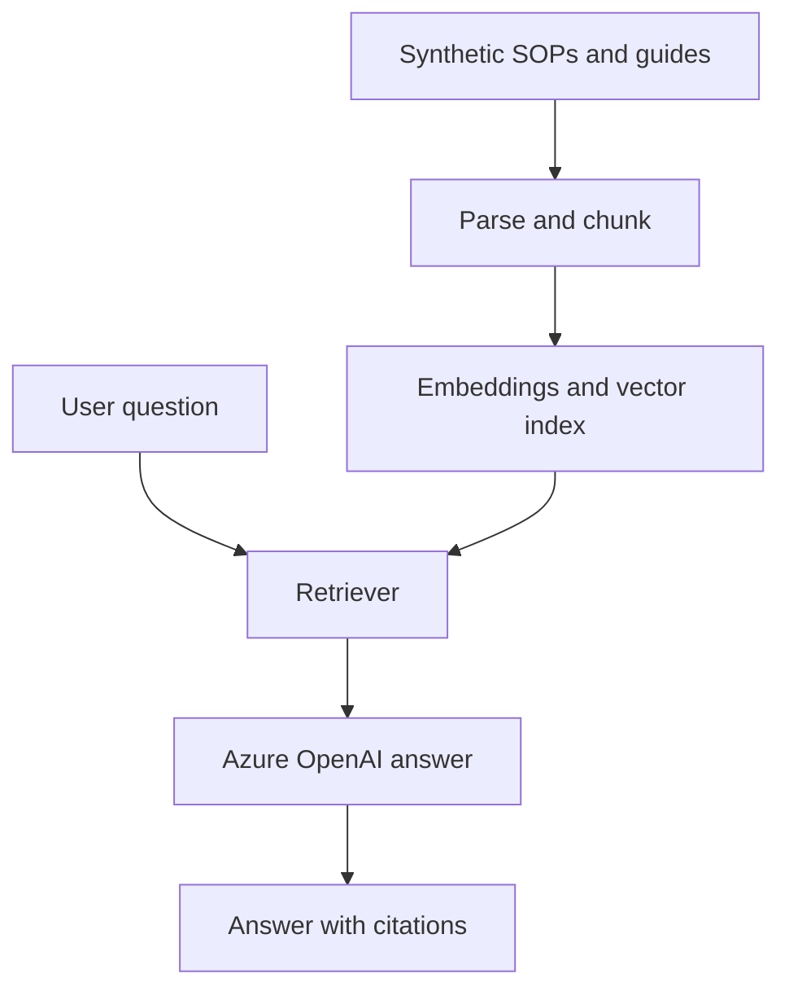

# FP&A Knowledge Assistant

Portfolio-safe reference design for a grounded finance knowledge assistant using Azure OpenAI, LangChain-style retrieval, SharePoint-style document ingestion, vector search, and Streamlit.

The sample implementation uses synthetic policy and reporting documents only.

## Use Cases

- Answer questions about reporting processes and timelines
- Retrieve KPI definitions with citations
- Support onboarding with grounded SOP guidance
- Explain which report or page contains a required metric
- Refuse unsupported answers when evidence is insufficient

## Architecture

## Production Controls

- Document-level access filters
- Source citations and retrieval scores
- Prompt-injection and unsupported-answer handling
- Evaluation dataset for groundedness and retrieval relevance
- Audit logging without storing sensitive question content unnecessarily
- Secrets supplied through managed configuration

## Resume Alignment

**Technologies:** Azure OpenAI, LangChain, RAG, SharePoint, Streamlit

Demonstrates contextual Q&A over SOPs, report guides, process documents, and project knowledge for onboarding and grounded retrieval.
