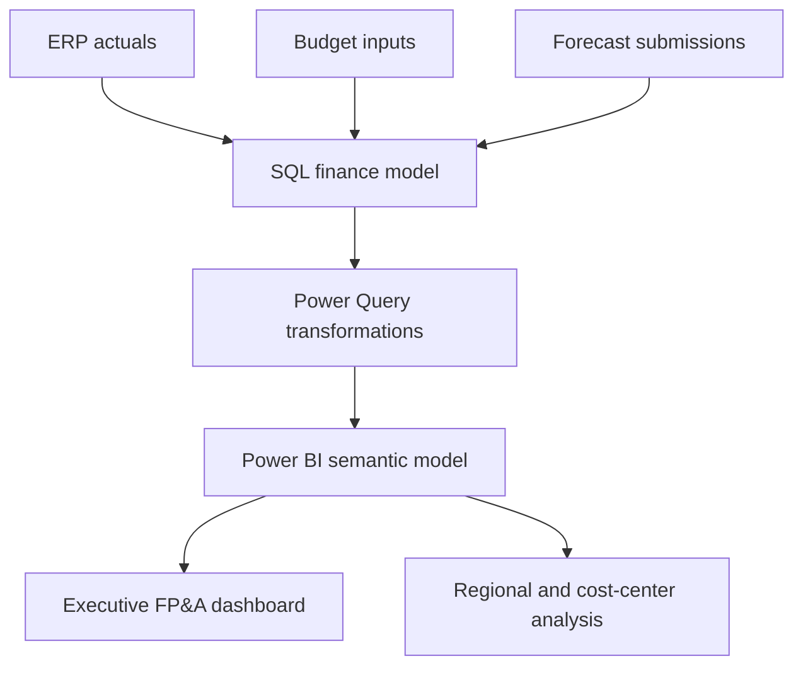
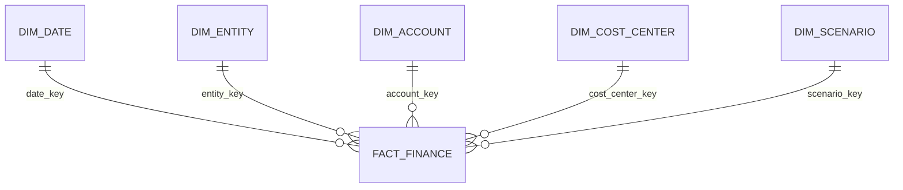

# FP&A Performance Management in Power BI

An enterprise-style Power BI solution for Actual, Budget, Forecast, variance, YTD, and full-year outlook reporting. The project uses a governed star schema, reusable DAX measures, parameterized Power Query, and row-level security patterns.

All data structures and examples are synthetic and contain no employer-confidential information.

## Business Problem

FP&A teams often combine monthly actuals, budgets, and forecasts from multiple systems and spreadsheets. Manual reconciliation creates inconsistent KPI definitions, slow month-end reporting, and limited drill-down from regional performance to accounts and cost centers.

This project provides a reusable semantic-model design for management reporting with consistent scenario, time-intelligence, and variance logic.

## Architecture



## Core Capabilities

- Actual, Budget, Forecast, and Prior Year comparison
- Monthly, YTD, YTG, and full-year outlook measures
- Absolute and percentage variance with safe divide handling
- Region, entity, cost center, account, and scenario drill-down
- Management P&L hierarchy with configurable display order
- Dynamic scenario selection
- Row-level security by regional ownership
- Parameterized SQL connection with no committed credentials
- Import-model and incremental-refresh design guidance

## Semantic Model



| Table | Grain / purpose |
|---|---|
| `FactFinance` | One amount per month, entity, account, cost center, scenario, and currency |
| `DimDate` | Calendar and fiscal attributes for time intelligence |
| `DimEntity` | Entity, country, and region hierarchy |
| `DimAccount` | Management P&L hierarchy, KPI group, and display order |
| `DimCostCenter` | Cost-center ownership and functional hierarchy |
| `DimScenario` | ACT, BUD, Forecast, and Prior Year scenario metadata |

## Repository Structure

```text
sql/finance_star_schema.sql       SQL Server dimensional model and synthetic seed data
dax/measures.dax                  Reusable FP&A measure library
power-query/finance-model.m       Parameterized Power Query transformations
security/rls-pattern.md           Dynamic regional RLS design
```

## Suggested Report Pages

1. **Executive Summary** — Net sales, operating cost, EBITDA, and full-year outlook
2. **Variance Analysis** — Actual vs Budget/Forecast waterfall and commentary
3. **P&L Detail** — Hierarchical matrix with month, YTD, and YTG views
4. **Regional Performance** — Region/entity comparison and contribution analysis
5. **Cost Center Review** — Functional spending, trends, and exceptions

## Performance and Governance

- Use a single-direction star schema and avoid fact-to-fact relationships.
- Keep scenario logic in reusable measures instead of duplicating visuals.
- Apply incremental refresh to the transaction fact when history is large.
- Store credentials in the Power BI service or gateway—not in Power Query code.
- Maintain an approved KPI dictionary and document measure ownership.

## Résumé Entry

> Designed an enterprise FP&A Power BI solution using a governed SQL star schema, reusable DAX time-intelligence and scenario measures, dynamic regional RLS, and parameterized Power Query to deliver Actual, Budget, Forecast, YTD, YTG, and full-year variance reporting.

