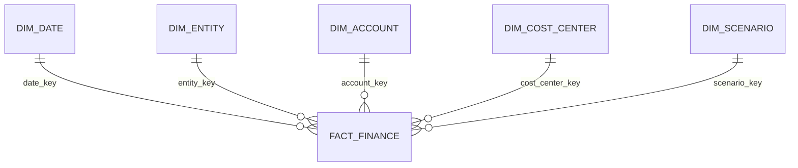

# FP&A Performance Management in Power BI

**Status: Reference implementation**

I created this project around a reporting problem I know well: finance teams need one model for Actual, Budget and Forecast, but the data usually arrives from different systems and at different levels of detail.

This repository does not contain a finished PBIX file yet. It contains the model components I would use to build one: a synthetic SQL star schema, reusable DAX measures, parameterized Power Query and a dynamic RLS pattern.

## What is included

- `sql/finance_star_schema.sql` creates the finance fact table, supporting dimensions and synthetic seed data.
- `dax/measures.dax` contains Actual, Budget, Forecast, YTD, YTG and variance measures.
- `power-query/finance-model.m` shows a parameterized SQL connection pattern without credentials.
- `security/rls-pattern.md` documents regional row-level security.

## Model grain

The finance fact table stores one amount for each month, entity, account, cost centre, scenario and currency. Separate dimensions provide the reporting hierarchies for dates, entities, accounts, cost centres and scenarios.

## Report pages I would build

1. Executive summary with Net Sales, operating cost, EBITDA and outlook
2. Actual versus Budget/Forecast variance analysis
3. P&L matrix with monthly, YTD and YTG views
4. Regional and entity drill-down
5. Cost-centre review with trends and exceptions

## Current limitation

Recruiters cannot yet see an actual dashboard because screenshots and a synthetic PBIX are not included. That is the next step for this project. I will add only visuals created from the synthetic model; no employer report, data or branding will be used.

## Design choices

I kept the model as a single-direction star schema, placed scenario logic in reusable measures and separated access rules from report logic. For a large fact table, I would add incremental refresh and validate control totals before publishing.

## Interview summary

I can use this project to explain the full path from finance requirements to dimensional modelling, DAX, Power Query, security and report design, while keeping the public example independent of confidential company work.
