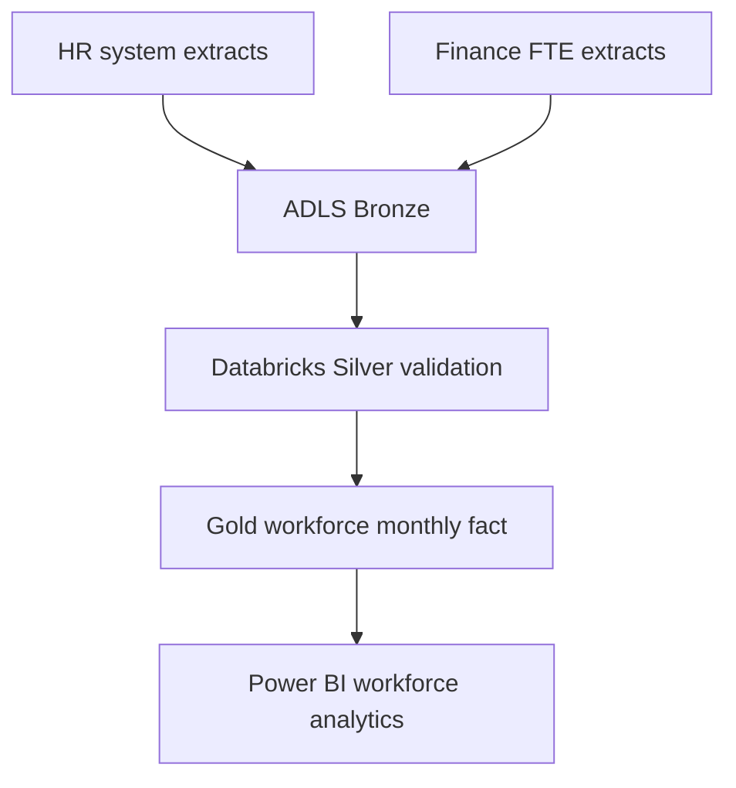

# FTE Data Platform & Workforce Analytics

Synthetic workforce-data platform demonstrating ingestion, validation, dimensional modelling, and Power BI measures using ADLS Gen2, ADF, Databricks, PySpark, Delta Lake, and Power BI patterns.

No employee-level or employer-confidential data is included.

## Architecture

## Model Grain

One record per employee surrogate key, month, entity, cost center, and employment type. Synthetic identifiers are used throughout.

## KPIs

- Month-end FTE and headcount
- Joiners, leavers, and net movement
- Average FTE and base pay per FTE
- Region, entity, function, and cost-center views
- Data-quality exceptions and source reconciliation

## Resume Alignment

**Technologies:** ADLS Gen2, ADF, Azure Databricks, PySpark, Delta Lake, Power BI

Demonstrates integration of finance and HR-style sources into governed dimensional workforce datasets with automated transformation and validation.
