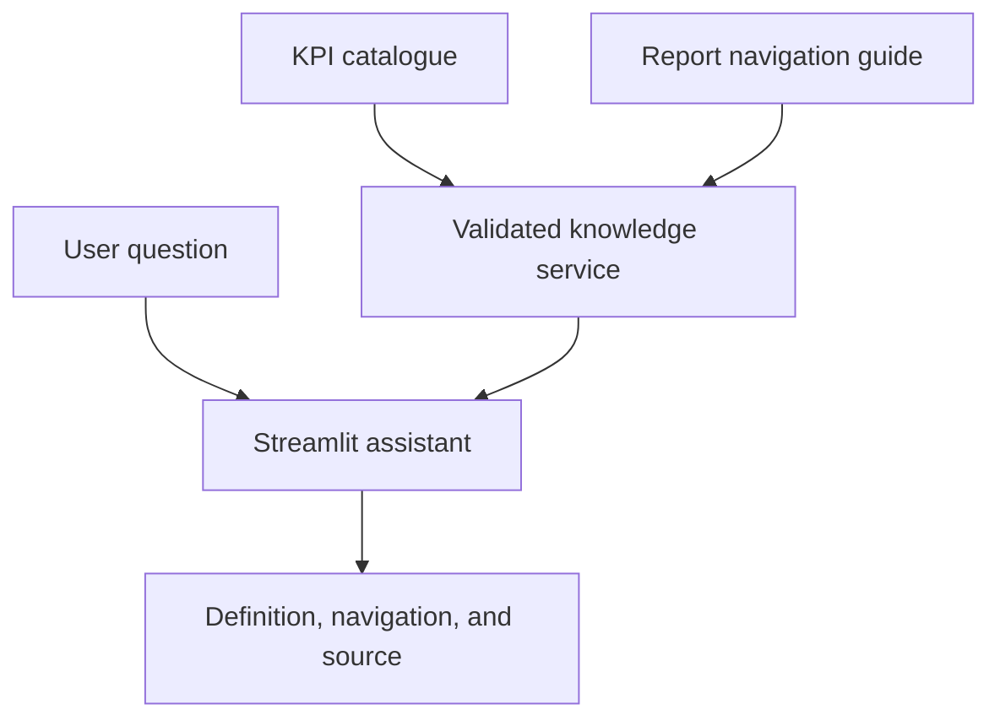

# Report Navigation & KPI Help Assistant

Synthetic conversational assistant for explaining Power BI report navigation, business definitions, filters, ownership, and KPI calculation logic.

## Design

The assistant retrieves answers from a governed KPI catalogue rather than inventing metric definitions. Each response includes the KPI owner and source reference.

## Architecture

## Capabilities

- KPI definition and formula explanation
- Report/page navigation guidance
- Scenario and filter interpretation
- Business owner and refresh-cadence lookup
- Unknown-KPI response instead of hallucination
- Power BI deep-link pattern for approved report pages

## Resume Alignment

**Technologies:** OpenAI, Power BI, Streamlit

Demonstrates how conversational guidance can reduce routine support requests and improve report adoption.
