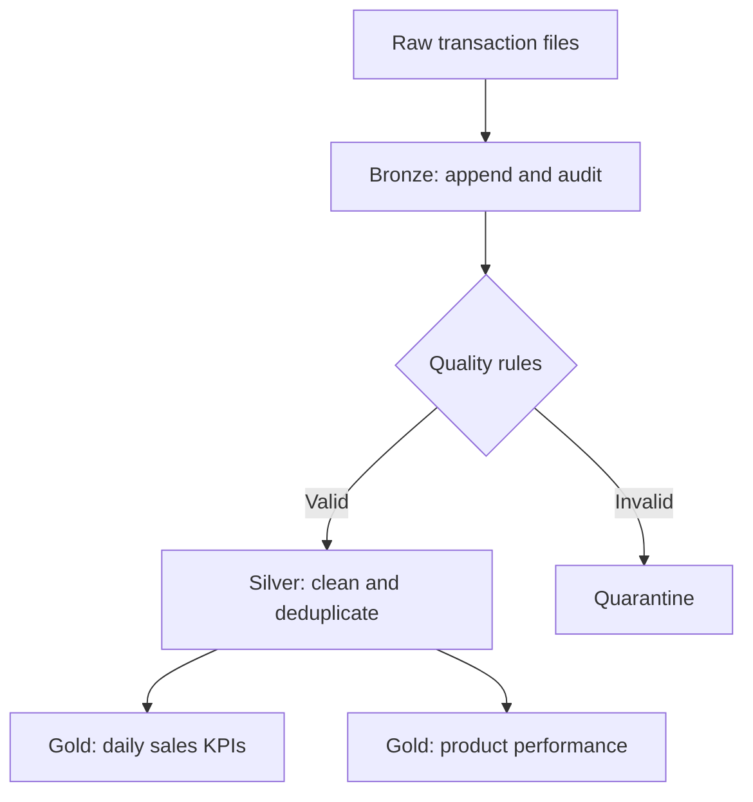

# Retail Sales Lakehouse

## Business Problem

A retailer receives daily transaction files from multiple stores. The source can contain duplicates, invalid quantities, missing customer identifiers, and late-arriving updates. Business teams need trustworthy daily sales, product performance, and customer metrics without reprocessing the entire history.

This project implements an incremental Medallion Architecture pipeline that converts raw sales events into validated, business-ready Delta tables.

## Architecture



## Engineering Features

- Explicit schema and ingestion metadata
- Duplicate removal using the latest `updated_at` value
- Configurable data-quality rules with quarantined records
- Incremental upsert pattern using Delta `MERGE`
- Gold-layer aggregations for reporting
- Unit tests for transformation logic
- CI workflow for syntax validation and tests

## Data Model

| Layer | Table | Purpose |
|---|---|---|
| Bronze | `bronze_sales` | Immutable source-aligned records with ingestion metadata |
| Silver | `silver_sales` | Validated and deduplicated transactions |
| Silver | `quarantine_sales` | Rejected records with failure reasons |
| Gold | `gold_daily_sales` | Daily revenue, order count, units, and customer KPIs |
| Gold | `gold_product_performance` | Product-level revenue and units |

## Run Locally

```bash
python -m venv .venv
source .venv/bin/activate
pip install -r requirements.txt
pytest -q
```

In Databricks, configure the catalog and schema, then call the transformations from a scheduled Workflow. Secrets and environment-specific paths should be supplied through secret scopes or deployment configuration.

## Example Résumé Entry

> Built an incremental lakehouse pipeline using PySpark and Delta Lake, implementing Bronze/Silver/Gold layers, schema enforcement, deduplication, data-quality quarantine, Delta MERGE upserts, automated tests, and CI validation for business-ready sales KPIs.

## Future Enhancements

- Auto Loader with checkpointing and schema evolution
- Slowly Changing Dimension Type 2 customer model
- Structured Streaming pipeline
- Databricks Asset Bundles deployment
- Observability dashboard for freshness, volume, and quality SLAs
